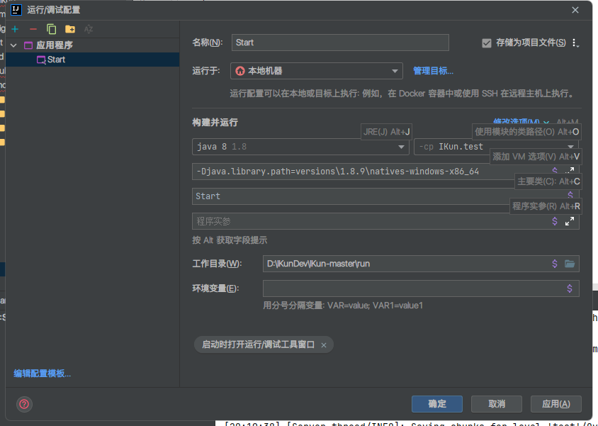

# IKUN Client
## Help me I need help!
The original Author was leave, but I don't know how to write a good client, I need Your help! to make a good IKun Client.
## 导入项目
1. 运行HMCL.bat，直接下载1.8.9原版并启动 (Run HMCL.bat download a vanila 1.8.9 and launch.)
2. IDEA里从现有源代码导入项目，选择build.gradle
(build need so many time, just wait...)
3. 完成
(IDEA Run/Debug config like this, It's Windows11, Windows10 is not this)
